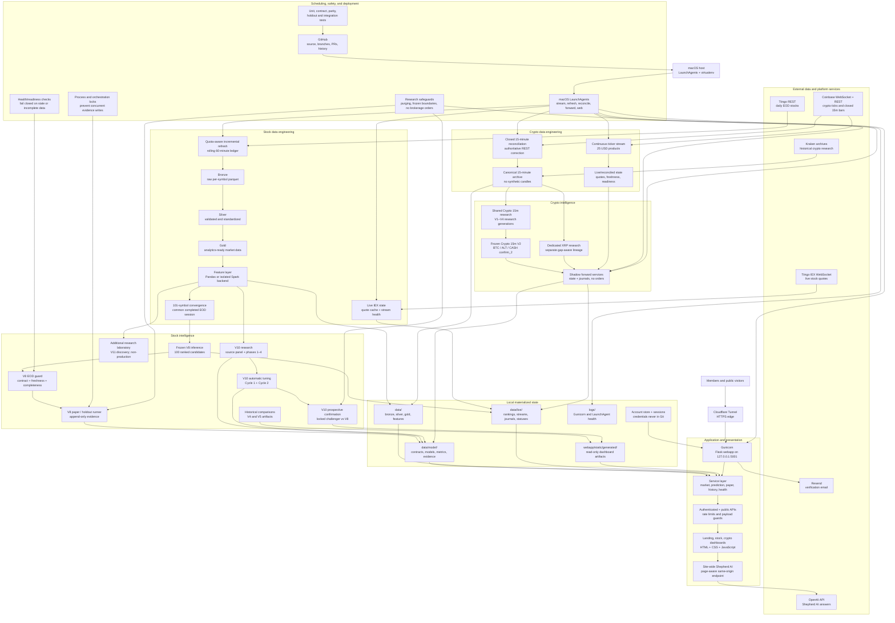

# Data Shepherd Engineering — System Architecture

This document describes the complete repository and runtime architecture as of
2026-08-22. It separates authoritative data flows, research-only workflows,
frozen/forward evaluation, presentation, and external services.

## Operational paths

| Path | Trigger | Main flow | Output | Safety boundary |
|---|---|---|---|---|
| Stock EOD | Quota-aware LaunchAgent | Tiingo → Bronze → Silver → Gold → Features → V8 inference | Rankings, readiness and comparison artifacts | All symbols must converge; guard fails closed |
| Stock live | KeepAlive LaunchAgent | IEX WebSocket → live cache → web services | Live quotes and stream-health panels | Latest EOD fallback when live data is unavailable |
| V8 evaluation | EOD orchestrator / backup scheduler | Guard → frozen-contract verification → append-only runner | Paper/holdout status and journal evidence | No pre-boundary evidence; shared lock; no orders |
| V10 research | Explicit research commands | Source panel → phases → automatic tuning Cycles 1/2 | Development metrics and candidate registries | Development-only; prospective confirmation and formal holdout remain separate |
| Crypto live | KeepAlive LaunchAgents | Coinbase stream + REST reconciliation | Live tickers and authoritative closed 15m bars | Missing candles are not synthesized |
| Crypto forward | Scheduled shadow services | Reconciled archive → frozen policy → state/journal | BTC/ALT/CASH and XRP shadow state | Hash/policy verification; no brokerage execution |
| Web | KeepAlive LaunchAgent | Gunicorn → Flask services → APIs/templates | Member dashboards and public landing pages | Secure cookies, authentication, rate limits |
| Shepherd AI | User question | Visible page context → Flask endpoint → OpenAI | Plain-text site explanation | Server-side key; bounded context; no financial advice or order execution |

## Persistence boundaries

- **Source control:** code, tests, documentation, templates, static application assets.
- **Materialized data:** Bronze/Silver/Gold/features, canonical crypto history, and live state.
- **Research evidence:** model contracts, metrics, manifests, frozen specifications, and journals.
- **Published presentation:** generated JSON consumed by dashboard JavaScript.
- **Secrets:** local environment only; API keys and credentials are excluded from Git.
- **Historical lineage:** retired-generation artifacts may remain as provenance but cannot
  be relabelled as new evidence or used to reopen a frozen selection decision.
